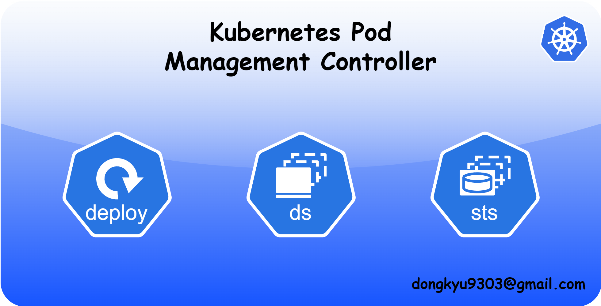

# k8s-pod-management-controllers



이 문서는 Kubernetes에서 파드를 관리하는 세 가지 주요 컨트롤러인 `Deployment`, `DaemonSet`, `StatefulSet`의 역할과 차이점을 설명합니다.
각 컨트롤러의 목적, 주요 기능, 사용 사례 및 기본 YAML 예시를 제공하여, 애플리케이션의 특성에 맞게 올바른 컨트롤러를 선택하고 배포하는 데 도움을 주고자 합니다.

## Overview

Kubernetes에서 `Deployment`, `DaemonSet`, `StatefulSet`은 파드를 관리하는 컨트롤러지만, 각각 목적이 다릅니다.

- **Deployment:** 무상태 애플리케이션의 배포와 롤링 업데이트에 최적화되어 복제본 관리를 지원합니다.
- **DaemonSet:** 각 노드에 단일 파드를 배포해 로그 수집, 모니터링 등 노드 단위 서비스에 적합합니다.
- **StatefulSet:** 상태 저장 애플리케이션에 고유 네트워크 ID와 지속 스토리지 보장합니다.

## Deployment


### Key Points

- **Stateless (무상태 애플리케이션)**
    - 무상태 애플리케이션(Stateless Application)을 위한 컨트롤러 이며, 배포에 적합합니다. 각 `Pod`가 독립적으로 동작합니다.
- **Rolling Updates & Rollback (롤링 업데이트 및 롤백)**
    - 애플리케이션의 새로운 버전으로 점진적으로 교체가 가능합니다.
    - 중단 없이 서비스 업데이트가 가능하며, 문제가 생길 경우 롤백할 수 있습니다.
- **Replica Management (복제본 관리)**
    - 사용자가 지정한 복제본 수 만큼 `Pod`를 유지하며, `Pod`가 예기치 않게 종료되면 자동으로 새로운 Pod를 생성해 복구합니다.
- **Scalability (확장성)**
    - 트래픽 변화에 따라 `Pod` 수를 쉽게 늘리거나 줄일 수 있습니다.

### Use Case

- **Web Server, API Server**
    - 트래픽에 따라 자동 확장이 필요할 때, 복제본을 관리하는 데 적합합니다.
- **CI/CD Pipeline**
    - 빈번한 업데이트와 배포가 요구되는 환경에서 안정적인 배포를 보장합니다.

### Sample YAML Deployment

```yaml
apiVersion: apps/v1
kind: Deployment
metadata:
  name: example-web-app
spec:
  replicas: 3
  selector:
    matchLabels:
      app: web
  template:
    metadata:
      labels:
        app: web
    spec:
      containers:
      - name: web-container
        image: nginx:latest
        ports:
        - containerPort: 80
```

## DaemonSet


### Key Points

- **Node-Specific Applications(노드별 애플리케이션)**
    - 클러스터의 모든(또는 특정) 노드에 하나의 `Pod` 복제본을 배포하는데 사용됩니다.
- **System Services(시스템 서비스)**
    - 로그 수집, 모니터링 에이전트, 네트워크 프록시 등 각 노드에서 실행되어야 하는 시스템 데몬에 적합합니다.
- **Automatic Updates(자동 업데이트)**
    - 클러스터에 새로운 노드가 추가되면 자동으로 `Pod`가 해당 노드에 배포됩니다.

### Use Case

- **Logging Agents**
    - `Fluentd`와 같이 클러스터 내 모든 노드에서 로그를 수집하는 경우
- **Monitoring**
    - `Prometheus Node Exporter`와 같이 각 노드의 메트릭을 수집하는 에이전트
- **Network Plugin**
    - CNI(Container Network Interface) 플러그인 또는 기타 네트워크 관련 에이전트

### Sample YAML DaemonSet

```yaml
apiVersion: apps/v1
kind: DaemonSet
metadata:
  name: log-collector
spec:
  selector:
    matchLabels:
      app: log-collector
  template:
    metadata:
      labels:
        app: log-collector
    spec:
      containers:
      - name: log-collector-container
        image: fluentd:latest
        resources:
          limits:
            memory: "200Mi"
            cpu: "100m"
```

## StatefulSet


### Key Points

- **Stateful Applications(상태 저장 애플리케이션)**
    - 각 `Pod`가 재시작 후에도 상태와 데이터를 유지할 수 있도록 관리합니다.
- **Stable Network Identity(안정적인 네트워크 ID)**
    - 각 `Pod`는 고유한 호스트 이름과 DNS 엔트리를 가지며, 이는 분산 시스템에서 연결과 상태를 유지하는 데 중요합니다.
- **Persistent Storage(영구 저장소)**
    - 각 `Pod`에 고유한 PVC(PersistentVolumeClaim)을 제공하여, 데이터가 `Pod` 가 삭제되거나 재시작 후에도 유지됩니다.

### Use Case

- **Database**
    - MySQL, PostgreSQL 등 상태와 데이터의 지속성이 필요한 경우
- **Messaging Queue & Distributed Storage(메시징 큐 및 분산 저장소)**
    - Cassandra, Kafka 등 데이터 일관성이 중요한 애플리케이션
- **State Cache Server**(상태 캐시 서버)
    - Redis, Memcached 등

### Sample YAML StatefulSet

```yaml
apiVersion: apps/v1
kind: StatefulSet
metadata:
  name: example-database
spec:
  serviceName: "database"
  replicas: 3
  selector:
    matchLabels:
      app: database
  template:
    metadata:
      labels:
        app: database
    spec:
      containers:
      - name: database-container
        image: postgres:latest
        ports:
        - containerPort: 5432
        volumeMounts:
        - name: data
          mountPath: /var/lib/postgresql/data
  volumeClaimTemplates:
  - metadata:
      name: data
    spec:
      accessModes: [ "ReadWriteOnce" ]
      resources:
        requests:
          storage: 1Gi
```

## Summary

| **항목** | **Deployment** | **DaemonSet** | **StatefulSet** |
| --- | --- | --- | --- |
| **목적** | 무상태 애플리케이션 배포 및 관리 | 모든(또는 특정) 노드에 데몬 형태의 파드 배포 | 상태 저장 애플리케이션 배포 및 데이터 유지 |
| **롤링 업데이트** | 지원 (무중단 배포, 롤백 가능) | 지원하나, 노드별 순차 업데이트 고려 필요 | 지원 (순서 보장, 단계적 업데이트) |
| **고유 ID 보장** | ❌ 없음 – 파드 간 구분 필요 없음 | ❌ 없음 – 각 노드에 동일한 역할의 파드가 하나씩 배포됨 | ✔ 있음 – 각 파드에 고유한 네트워크 ID 및 스토리지 할당 |
| **사용 예시** | 웹 서버, API 서버, CI/CD 파이프라인 등 무상태 애플리케이션 | 로그 수집, 모니터링, 네트워크 플러그인 등 시스템 데몬 | 데이터베이스, 메시징 큐, 분산 저장소, 상태 캐시 서버 등 |